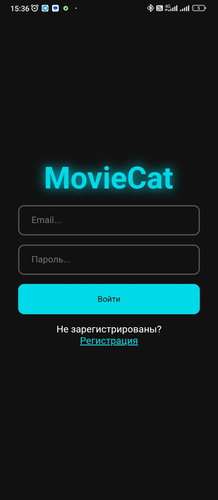
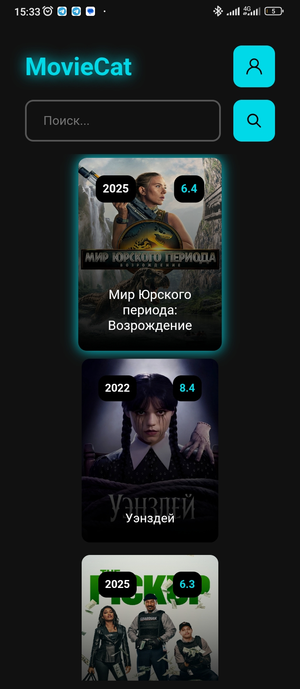
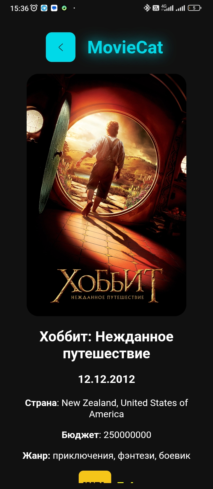

# 🎬 Moviecat

> Мобильная версия [интерактивного веб-приложения для поиска и просмотра фильмов и сериалов онлайн](https://moviecat.eagle.dev.stack.fvds.ru/).

## ✨ Демонстрация

🌐 [Скачать приложение под Android](https://github.com/NikolasEagle/moviecat-android/releases/download/1.1.0/Moviecat_v1.1.0.apk)

## 📖 Описание проекта

> Данный проект предоставляет пользователям возможность просмотра и поиска фильмов и сериалов онлайн. Проект был создан для того, чтобы попрактиковаться в работе с React, Node.js, TypeScript, Express, Docker и React Native.

## 🛠️ Технологии и Стек

| Технология   | Описание                                                                                       |
| ------------ | ---------------------------------------------------------------------------------------------- |
| React Native | Фреймворк для разработки нативных мобильных и настольных приложений на JavaScript и TypeScript |
| React        | UI библиотека для построения интерфейса                                                        |
| Node.js      | Серверная часть                                                                                |
| Express      | Легкий серверный фреймворк                                                                     |
| PostgreSQL   | База данных пользователей                                                                      |
| Redis        | Хранилище сессий в формате ключ:значение                                                       |
| Docker       | Программная платформа для разработки, доставки и запуска контейнерных приложений               |

## 📷 Скриншоты

## ✍️ Автор

- [@NikolasEagle](https://github.com/NikolasEagle)
- Telegram: [https://t.me/EglPC](https://t.me/EglPC)
